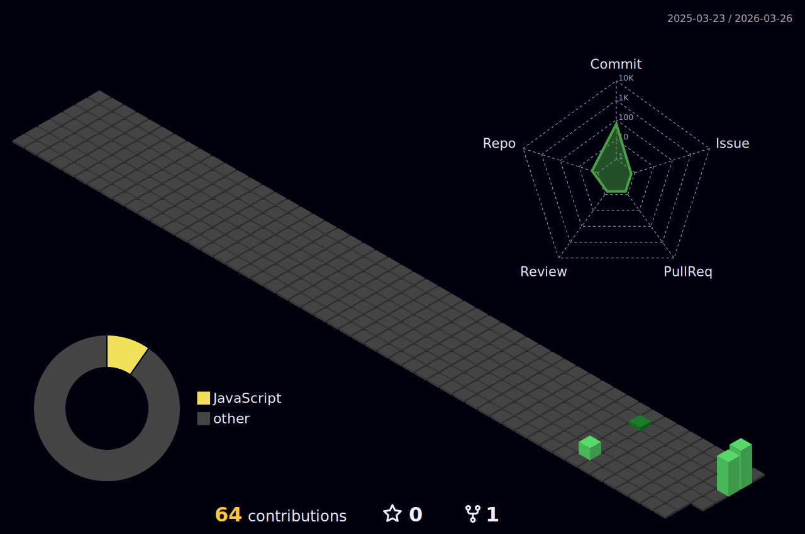

  
  # Hi there, I'm Shivam Tiwari 👋
  
  

  *A 3rd-year engineering student specializing in robust backend development, database architecture, and API design. I enjoy solving complex structural problems and have a deep interest in cryptography.*

 

### 🛠️ Tech Stack & Tools

  
  
  
  
  
  
  

 

### 🚀 What I'm Currently Working On
* Architecting the backend and UML workflows for a **Tea Business Management System**.
* Leading the development of **VisionQueue**, focusing on scalable backend processes.
* Researching advanced cryptographic concepts like **Homomorphic Encryption**.

 

### 🏙️ My Contribution Architecture

  

 

### 📈 GitHub Stats

  
  

